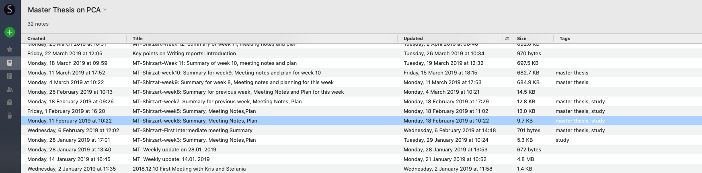
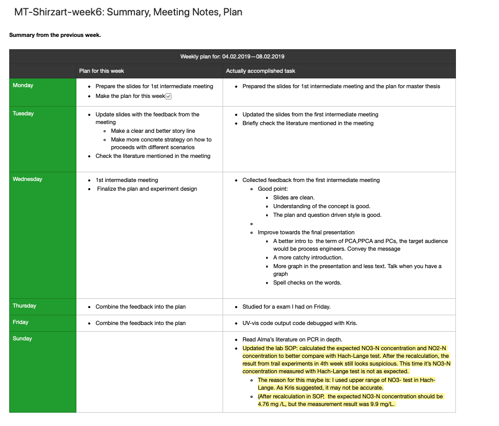
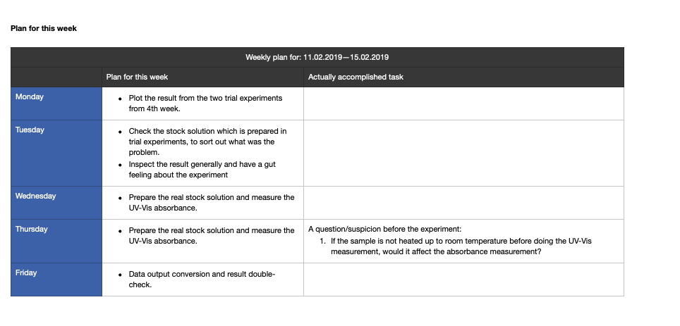

Last year, during this time, I was sprinting my last month of work for my master thesis. At that time, I had a general impression the result would be rather good. 1 month after that I finished my master thesis and submitted it. From the beginning of my thesis work, I had a clear goal in mind to obtain a great grade for it.

I finished my thesis 1 month later. To this day, I still remember when I walked into the assistant’s office, I felt quite anxious. My heart was beating fast as if I missed something crucial. However, when I tried to calm down and go through the details, I couldn’t find anything that led to anxiety.

2-3 months later, I finally received my grade. It was waaayyy lower than my expectation. I just couldn’t make my head around it, because even my supervisor was saying “great job”, “well done” all the time.

In retrospect, my thesis wasn’t perfect. Something could be done differently. One of the biggest reasons that I received a low grade was: “He works hard and fast, but without a plan.” Although I had a plan at that time, it turns out I still failed my thesis to my standard.

If I have a chance to do it differently, I would rethink it on the following 6 aspects:

# 1. Have a plan and manange it correctly

Right from the beginning of my thesis, I had a kickoff meeting with my supervisor about the thesis work. Except for talking about technical details, the most important thing they remind me was to have a plan to secure the success of my thesis.

And I did.

I had weekly plans like the following

The note of each week contains a summary from the previous week and a plan for this week:

However, with all these plans implemented, **My supervisor still had the impression that I didn’t have a plan. It means something went wrong in the execution.** Having a plan doesn’t guarantee success. You need to be able to execute it, measure it, reflect on each week’s process, and improve on it.

Managing a master thesis is actually a project management task. Implementing a proper project management scheme would actually be really helpful. Between the most widely used project management scheme, implementing a waterfall project management could be really helpful. **Because the scope, cost are defined before the thesis.** Even though the goal of the thesis may be adjusted along the way in some cases, most often the scope is predefined and you need to guarantee success.

Compared to my weekly reflection and planning method as above, waterfall project management can give you a good overview of workload distribution in each week, adjust your plan when there is still time left, and control the cost. All of this is possible because of the Gantt chart – the main tool used for waterfall project management.

If I could have done my thesis again, I would manage it better using waterfall project management.

# 2. Keep a balance between being independent and seeking guidance.

I graduated from one of the best universities in Europe, a place where they always encourage you to ask questions. As we all know, “There are no dumb questions”. While being curious and inquisitive will definitely help you in the class, when working on a project with supervisors, you need to keep a good balance.

Entering my thesis work, my goal is to reach the goal I proposed when I start my thesis and learn from it as much as I can. Along with my thesis progress, I always trying to be communicative and ask questions to my supervisors about my progress, my working method and how should I improve. 

However, these questions sometimes were not only about my thesis design and execution, but I also asked some technical trick in programming and algorithms to expand my knowledge. I thought this would leave a good impression.

In the end, I also received a comment from my supervisor saying “Sometimes, he needs too much help”. It’s understandable that your supervisors also have a lot of other responsibilities. Bothering them too much will leave an impression of not being independent enough.

If I could have done it one more time, I would restrain myself from asking questions that are not relevant for my thesis.

# 3. Writing style and perfection 

A great thesis comes with great academic writing skills. This might have been my weakest point throughout my thesis work. From the beginning, a thesis work was defined in my department to be less than 30 pages, not including the appendix. Some people chose to populate the appendix to show off all the work they have done, while I chose to write a brief thesis and only put in relevant content to the appendix. This style itself was a challenging one. In the end, the content of my thesis was 26 pages. I went through 3 rounds of correction with my supervisors before the hand-in.

However, a crucial mistake I made there was **adding or changing content the night before submission**. 

This ended up costing me a lot since many mistakes came from the last addition. I was just not confident enough to leave it and hand in the next day. For different people, it might work differently, but I had more than once experience that **changing the content in the last minute cost me more than the value brought by that change.**

# 4. Communication and Expecatation management

Another myth that hit me very hard after I get the result of my thesis is the difference between reality and expectation. Throughout my thesis work, 85% of the time the words I heard from my thesis were positive feedback, like “Good job” , “Well done”, and “You have the potential to write an excellent grade”. However, there was negative feedback two, when I underperformed for my second midterm presentation. They have told me about their disappointment and frustration about some persistent mistakes about my spelling mistakes. But it didn’t sound too negative for me and I didn’t feel strong disappointment as they did. This ends up costing me a lot.

Next time, when collaborating with a person who is going to grade me, I would definitely have a meeting with them and align everyone’s expectations. Most importantly, I would advise some to restrict from the too generous comments about my work. The best way to manage expectations is to align the criteria and the final goal. If I had been more explicit and aligned my goal with my supervisor, the result could turn out differently.

# 5. Motivation source: find the motivation from within, not without

While it might not be the best setting to discuss motivation sources since you receive a grade directly from your supervisors. So you will inherently have a big motivation to please them. But the disadvantages of this mechanism is, when you cannot receive 100% honest feedback or when you polish your work to their satisfaction, there is a big risk that objectively, your work might not be so good.

Whenever possible, you should seek motivation from within. You need to own your project, own your thesis, and your work by setting your goal, your expectation and motivate yourself with less external incentives but more with internal incentives. Only in this way, there won’t be a perfect solution for anything, but always a better one. Freeing yourself from other people’s expectations and instead striving to meet our own needs, would be the most independent long term motivation that drives us safe and far.

I learned this only after my thesis, after a tearful and heart-breaking meeting.

I wish I could have done my thesis in all these different ways :)