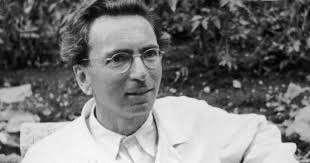

I am not sure from where or who did I first hear about Victor Frankl and his book "Man's search for meaning." But it always have been a book that I wanted to read. Surviving one of the most serious disaster in human history, his book presented detailed his physical and mental suffer in several concentration Nazi's concentration camps. With his surviving off the camp, he proves that in whatever condition a mankind face, even the worst possible one, there is still encoded freedom and dignity in human nature. However dim a man's life can be, there is always a meaning to it.

Frankl was an established psychiatrist by the beginning of 1940. Parallel to the Freud and Adler, Victor is the representative of the third school of psychiatry theory: Logotherapy. He showed his talent in a young age and studied with both Freud and Adler, he didn't agree with either school of psychology. He firmly believed that human life is not centered by the pursuit of happiness nor the pursuit of superiority. Instead, the central thesis of human's life is a meaning. With some years of practice, he further developed the theory and started to write a book.

Before he was taken in to Auschwitz in 1940, he was already established and running a clinic in Vienna, which still took Jewish people. When Nazis suddenly appeared at his door and took him to the camp, he had the manuscript of the book with him. Little did he know, the only asset he could preserve in the camp is his bare body. Yet it is still the luckiest case.

Going through of the worst condition one could imagine and survived with sheer luck, in this book, Frankl breaks down the three phases of mental struggle that a typical prisoner goes through. Everyone who wasn't sent to the gas chamber still faced a tough mental challenge with extreme weather and physical conditions to preserve mental sanity. **Once the belief of survival is gone, disease will soon conquer the very weak body and take away once's life**.  

It is in this extreme condition, Frankl proved his theory by holding up to the belief that **all these suffering will have a meaning and his life has a meaning.**
With this strong belief, not only did he survived concentration camps, he also lived a long life until 92 years old. When was taken to the camp, he was 35. Five years would passed when he survived and it also took away his wife, brother, and both parents. He would never made it out and had an impactful life until 92, if he hadn't hold on to the strong purpose **he chose for himself**.

Seeing him overcoming all the psychological challenges gives the reader a sense of confirm and encouragement, to boldly pursue one's purpose without any hesitations. As one of my favorite excerpt from the book says:

> Live as if you were living for the second time and had acted as wrongly the first time as you are about to act now.

