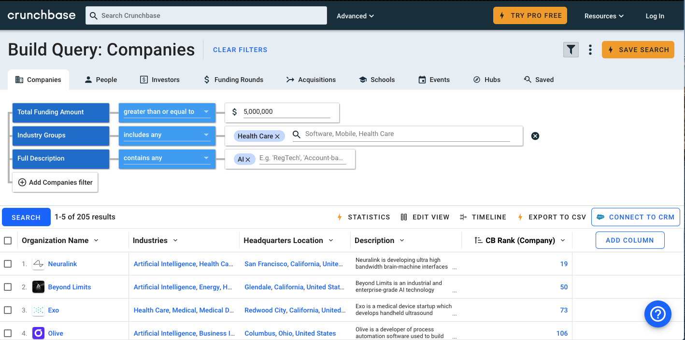
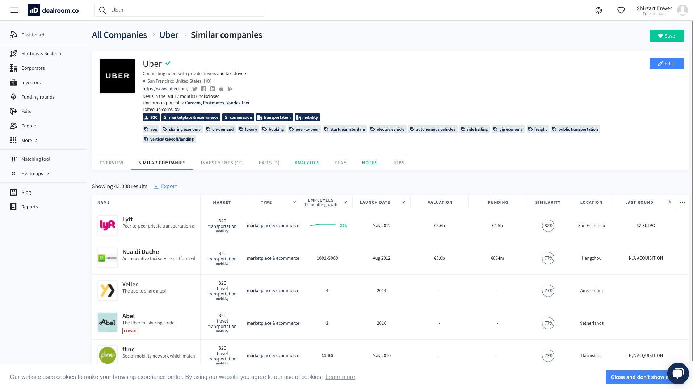
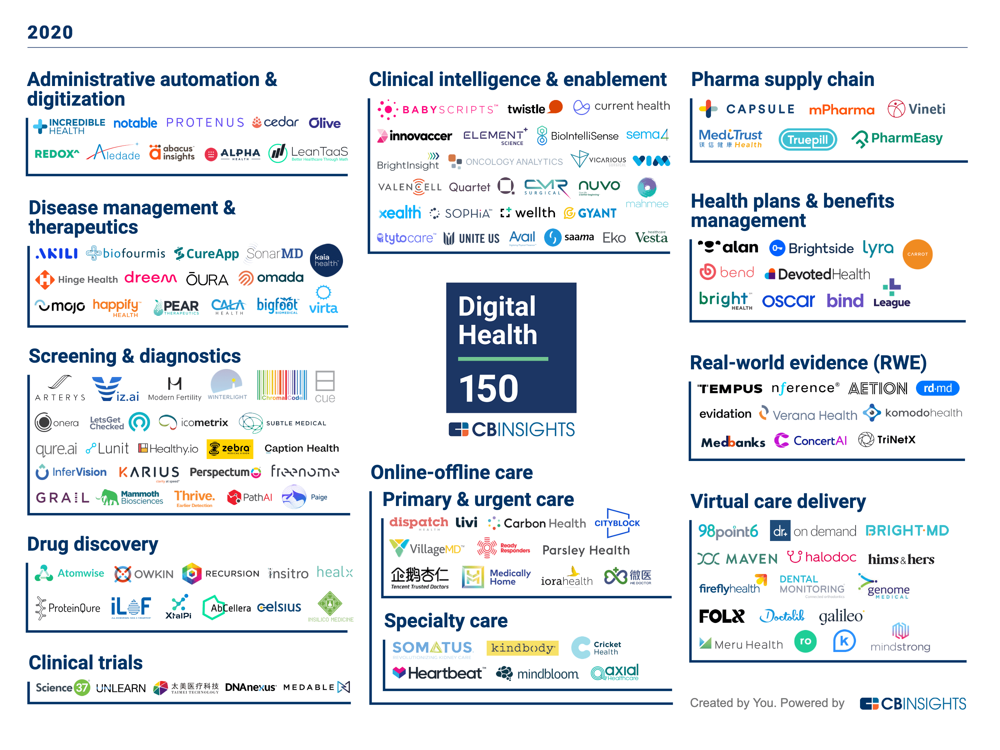
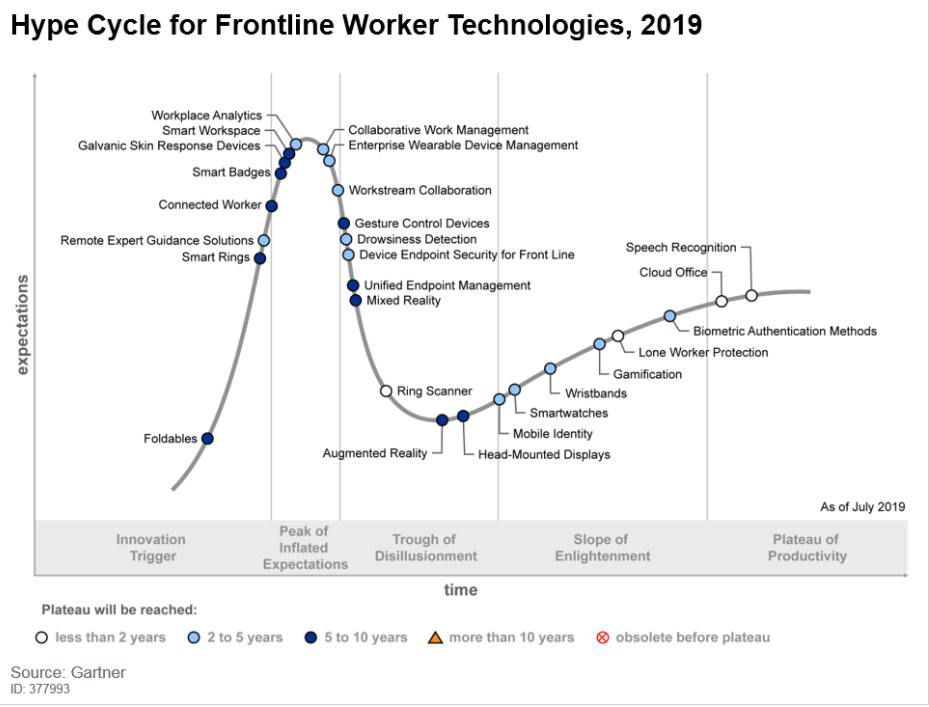

Innovation is one of the most exciting elements that drives the progress of humanity. While many forms of innovations take place on different scales, startups are one of the key driver for innovative technologies to have a real impact on our daily life. However, not every startup will make it to be a standing enterprise that brings innovation on regular basis. Thus, being able to spot the right startups, the one that really makes impact on the long term is a treasurable skills.

I’ve always wanted to obtain these skills. Yet, I am still on my way to have a diamond-spotting eye. However, I did accumulate some experiences in 2-3 startup market research projects that I did. This is a introductory guide for people who want to get their hand on the market research fast and efficient.

## Pick your sward for the fight: great search engines for startup data.

A good warriors looking for the victory on the battle field, will never be shy on polishing their weapons.  While startup market is very early staged and doesn’t have a nice consistent data quality and no plat form has all the data about the startups around the world. **It makes a good search engine stand out even more**.

Here are the three platform, that’s friendly to  individual users, with nice trial free trial option for you to rocket your search.

### Crunchbase: powerful query builder and nice design

Crunchbase has been a very established platform in the field. It's also easily the go to option if you are looking for a platform that is friendly to free plan users.

1. Pro
	1. Comprehensive and accurate data bases
	2. Most powerful query tools
	3. Nice UX experience. Easy to navigate to different information.
2. Cons
	1. Expensive pro plan
3. Bonus
	1. Friendly refund policy for accidental extension of pro plan

I had several times ran into the problem of forgetting to cancel my subscription plan for crunchbase. Then I got a bill of approx 780 dollars on my credit card each time. However, the great thing about crunchbase is, **as long as you file an refund request within 1 week of paying the subscription fee**, you will be able to get your money back. And you don't really have to write a very pity email to ask them. Their customer service staff is really awesome. The official link for this policy is [here](https://about.crunchbase.com/terms-of-service/cancellation-policy/#:~:text=For%20example%2C%20if%20you%20signed,charges%20associated%20with%20your%20subscription).

### Dealroom: collection of similar companies

Dealroom is a newly emerged startup from Europe that is specifically targeting the field of company research. They have caught some attentions by winning some awards.

1. Pro
	1. Nice and clean UI
	2. Good data quality
	3. Similarity metrics
	4. No clear of the cost of pro plan yet
2. Con:
	1. Smaller databases

### CBinsight: Great cluster analysis and summary

CBinsight is well-known for their research output. I've been subscribed to CBinsights' newsletter. From time to time, they will show you a very well down cluster graph that is almost all-inclusive in the targeting area.
For example, the following graphs summarized startup that worth paying attention
to in the digital health market.

1. Pro
	1. Great cluster analysis graph
	2. Great research insights
2. Con:
	1. Short trial period
	2. Relatively bad UI experience

### A powerful auxiliary: Gartner report on startup hype

A great tool to have overall insights of certain industry from time perspective.  The before mentioned search engine only gives you a static data point in time. Gartner reports actually put the development of technology in development perspective. It’s a great tool to detect the potential of a certain company is as big as they promised on their website.

For example, graph like this that is showing the different stages of technology development in a particular field, gives you the time perspective when you are new in a certain technology market.

These are my 5 cents in useful market research tools. Hope this will be helpful for any beginners to tackle market research problems.
