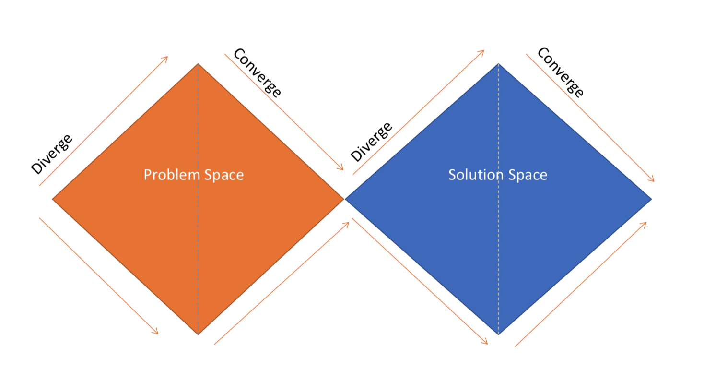

Do you like wondering about big ideas from now and then, but don't know if it's gonna be useful someday? Well most of us might had a day or two where you think about another way of going to school, taking classes, commuting in the cities or just having a different memory system or anything,  like the kind of future scenario that none of the science fiction wrote about it, yet its so intriguing. The joy of indulging myself in the wonderland of imagination is always so liberating. Yet most of these things never make a stop further than being forgotten at the back of your brain.

Sometimes, I also enjoy building things from scratch. Unlike the most geeky kids who started out with computer programming at early age, my earliest building projects were all kinds of Mini models that compose a great toy after being built. There was a time when a Japanese Anime about miniature 4WD was viral in Urumqi. I spent numerous evenings of my primary school days to build them. The joy of composing something that's working was unparalleled. I would easily spent 2 hours without thinking about anything else to try to finish the project.

However, it was not very easy most of the time to combine those joys together. The joy of thinking wildly and the joy of making something happen. The mismatch between the magnificat scale of envision and the limited power of implementation without technology was the limiting factor.

What if, there is something that make the gap between imagination and implementation so small that it won't even stop you from doing it?

Then you might what to know design thinking.

## Have both: Wild ideas + Fast implementation + Iterative improvement = Design Thinking

Design Thinking literally means the thinking process used by designers when they create a new concept. It is a perfect tool to utilize your big ideas and generate innovative solutions. It's maybe not the first framework to encourage fast implementation, nor wild ideas, nor iterative improvement. But the combination of these elements makes it an organic process for the solution and the problem to co-evolve, while delivering the solution that user never realized wanted. It's like delivering a car when the client says "I just want a faster horse."

While the three elements: wild ideas, fast implementation, and iterative improvement interplay in the process, it's not forseeable which ideas you will have and what implementation is it. It's possible to know what element of technology you want to add, however, before implemented, no one knows what will come up.

So how does design thinking actually work?

## Blank canvas to brilliant ideas: be open, test your assumption, be flexible

The key to have a successful design thinking session is to always be open to new ideas and be suspicious about the assumptions you make about the user. All these key elements are wrapped in an interactive session that is very well described by 2 diamond. Though there are different ways to represent the design thinking process, we developed this concept of 2 diamonds during InCube project. 

While the whole design thinking process breaks down into problem space and solution space, each spaces are made of a diverging process where you **brainstrom ideas and be open-minded** and a converging process where you **examine your assumptions** by using testing method such as rapid prototyping, etc. The key in the converging face is to be flexible and not fix your mind on an existing solutions. Moreover, the quality of diverging phase also set a tone of how innovative your solutions can be. The more open-minded you are, the more surprise you will find in the end.There are lot of techniques go into the process of testing and validating assumptions, which will not be discussed in detail here. 

Nevertheless, the design thinking process is never a one time project. The whole process could be repeated iteratively for as many times as you need when time is not a problem. The real joy I find in the process is when I can be as wild as I want in brainstorming, while being as rigorous as I can achieve in testing the assumptions and developing solutions. There is intellectual joy hidden in the making of a great idea or MVP. 

I guess this is why I :heart: Design Thinking :)